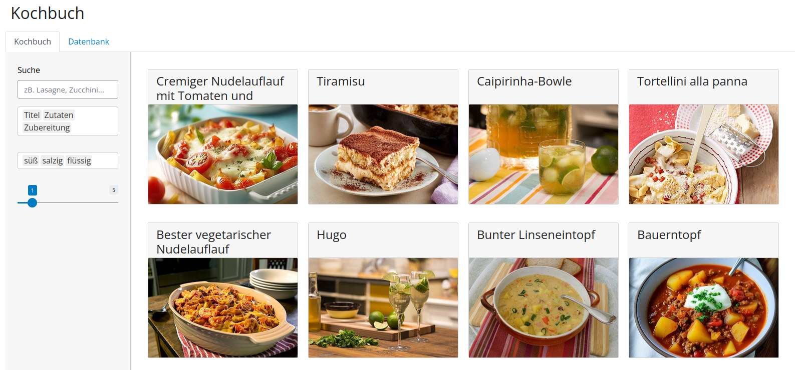

# kochbuch

## What it is
A cook book app where you can store, filter and access your recipes.
Features:
* Manage your recipes without relying on a proprietary website
* Filter recipes based on flavor ("sweet", "salty" etc) or on keywords (e.h. "zucchini")
* Multiply the given amount of ingredients according to your needs
* Direct recipe import from `chefkoch.de`

## Architecture
* Shiny-Python app (https://shiny.posit.co/py/)
* Runs inside docker containers
* Postgres database to store the recipes

## How to use
* create a .env file where you define POSTGRES_USER, POSTGRES_PASSWORD and POSTGRES_DB
* run `docker-compose up -d --build`
* The app should be available on http://localhost:3838
* When you get the error `no such file or directory, /app/.venv/bin/python`, the poetry environment did not properly load. Log into the container (`docker exec -it shiny_kochbuch bash`), go to kochbuch (`cd kochbuch`) and execute `poetry config virtualenvs.in-project true` and `poetry install`. Then rebuild the docker compose pipeline.